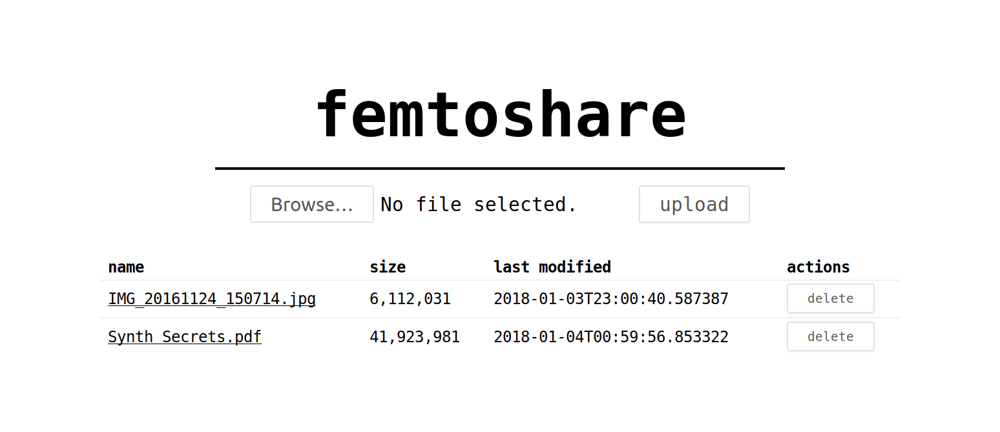

Femtoshare
==========

Ultra simple self-hosted file sharing in a single Python script, without any dependencies. All files can be accessed/modified by all users. Don't upload anything secret!

Quickstart: `wget https://raw.githubusercontent.com/Uberi/femtoshare/master/femtoshare.py; chmod +x femtoshare.py; femtoshare.py`, then visit `http://localhost:8000/` in your web browser.



Options:

    $ ./femtoshare.py --help
    usage: femtoshare.py [-h] [--port PORT] [--public]

    optional arguments:
    -h, --help   show this help message and exit
    --port PORT  local network port to listen on
    --public     listen on remote network interfaces (allows other hosts to see
                 the website; otherwise only this host can see it)

Rationale
---------

I often need to send/receive files from untrusted computers. Google Drive can be used for receiving, but not sending - I don't care about people seeing the files, but I do care about not revealing my account credentials when logging in to upload files.

Services like WeTransfer work for sending, but they often have tiny file size limits and long, hard-to-type file URLs, if they work at all.

I made Femtoshare to fix these issues. It's basically an FTP server that only needs a web browser to browse/download/upload. No file size limits and easily-memorized links, plus no worries about revealing important account credentials! A site-wide password is easily added to keep out the most unsophisticated attackers.

Deployment
----------

Minimal public-facing deployment: `wget https://raw.githubusercontent.com/Uberi/femtoshare/master/femtoshare.py; chmod +x femtoshare.py; ./femtoshare.py --port 1234 --public` is visible at `http://YOUR_HOST:1234`.

For improved security, authentication, and HTTPS support, we can run the script as a systemd daemon and put it behind an Nginx reverse proxy, configured to use HTTP Basic Authentication. Assuming a fresh Ubuntu 16.04 LTS machine:

1. SSH into the machine: `ssh ubuntu@ec2-35-166-68-253.us-west-2.compute.amazonaws.com`.
2. Run software updates: `sudo apt-get update && sudo apt-get upgrade`.
3. Harden SSH: in `/etc/ssh/sshd_config`, change `PasswordAuthentication` to `no` and `PermitRootLogin` to `no` and `AllowUsers` to `ubuntu`. Restart `sshd` using `sudo service sshd restart`.
4. Get requirements: `sudo apt-get nginx openssl`.
5. Get the code: `sudo mkdir -p /var/www/femtoshare && cd /var/www/femtoshare && sudo wget https://raw.githubusercontent.com/Uberi/femtoshare/master/femtoshare.py; sudo chmod +x femtoshare.py`.
6. Set up restricted user: `sudo adduser --system --no-create-home --disabled-login --group femtoshare` (there is a `nobody` user, but it's better to have our own user in case other daemons also use `nobody`).
7. Set up file storage directory: `sudo install -o femtoshare -g femtoshare -d /var/www/femtoshare/files`.
8. Set up systemd service to start Femtoshare on boot:

    ```bash
    sudo tee /lib/systemd/system/femtoshare.service << EOF
    [Unit]
    Description=Femtoshare

    [Service]
    Type=simple
    PrivateTmp=yes
    User=femtoshare
    Group=femtoshare
    ExecStart=/var/www/femtoshare/femtoshare.py
    Restart=always
    RestartSec=5

    [Install]
    WantedBy=multi-user.target
    EOF
    sudo systemctl daemon-reload
    sudo systemctl enable femtoshare.service
    ```

9. Set up a password file for HTTP Basic Authentication: `echo "user:$(openssl passwd -apr1 -salt 8b80ef96d09ffd0be0daa1202f55bb09 'YOUR_PASSWORD_HERE')" | sudo tee /var/www/femtoshare/.htpasswd`
10. Set up Nginx as a reverse proxy with HTTP Basic Authentication:

    ```bash
    sudo tee /etc/nginx/conf.d/femtoshare.conf << EOF
    server {
        listen 80;
        server_name ~.;

        # HTTP Basic Authentication
        auth_basic "Log in with username 'user' to access files";
        auth_basic_user_file /var/www/femtoshare/.htpasswd;

        # serve directory listing
        location = / {
            proxy_pass http://127.0.0.1:8000;
            client_max_body_size 1000M;
        }

        # serve uploaded file
        location ~ /.+ {
            root /var/www/femtoshare/files;
        }
    }
    EOF
    ```

11. Set up HTTPS with Let's Encrypt: `export LC_ALL="en_US.UTF-8"; export LC_CTYPE="en_US.UTF-8"; sudo wget https://dl.eff.org/certbot-auto && sudo chmod a+x certbot-auto && sudo ./certbot-auto --nginx --debug`
12. Set up twice-daily certificate renewal cronjob with Let's Encrypt: add `23 0,12 * * * PATH=/home/ubuntu/bin:/home/ubuntu/.local/bin:/home/ubuntu/bin:/home/ubuntu/.local/bin:/usr/local/sbin:/usr/local/bin:/usr/sbin:/usr/bin:/sbin:/bin:/snap/bin /var/www/femtoshare/certbot-auto renew >> /var/www/femtoshare/letsencrypt-renew-certificate.log 2>&1` in the root crontab with `sudo crontab -e` (setting `PATH` is necessary in order to get Nginx config updates to work).
13. Start Femtoshare and Nginx: `sudo systemctl start femtoshare.service` and `sudo service nginx restart`.
14. Allow incoming and outgoing HTTP and HTTPS traffic through the firewall.

License
-------

Copyright 2018-2018 [Anthony Zhang (Uberi)](http://anthonyz.ca).

The source code is available online at [GitHub](https://github.com/Uberi/femtoshare).

This program is made available under the MIT license. See ``LICENSE.txt`` in the project's root directory for more information.
